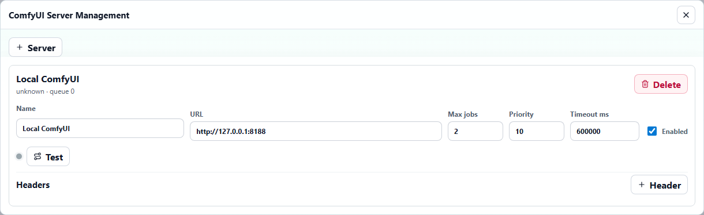
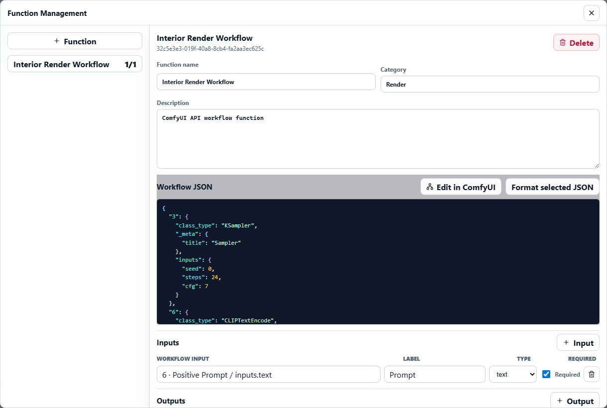
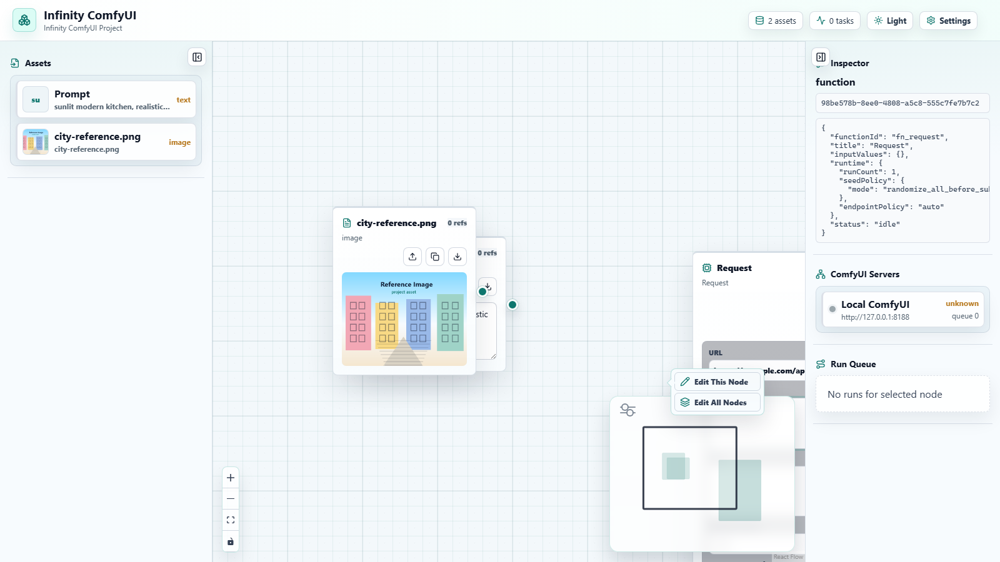
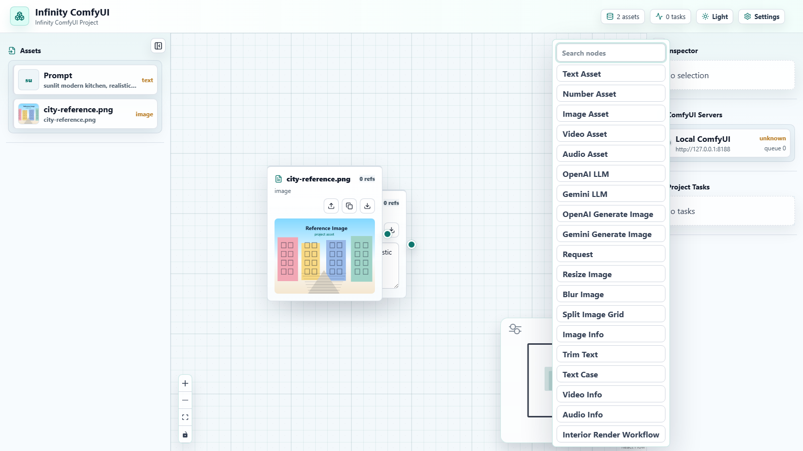
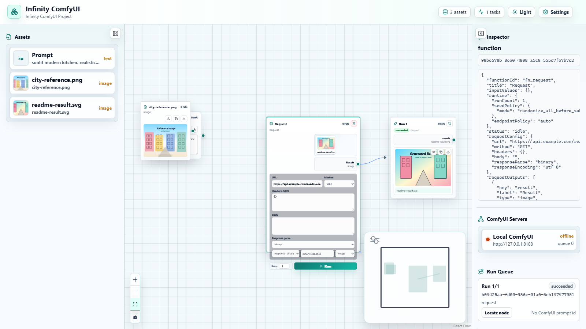
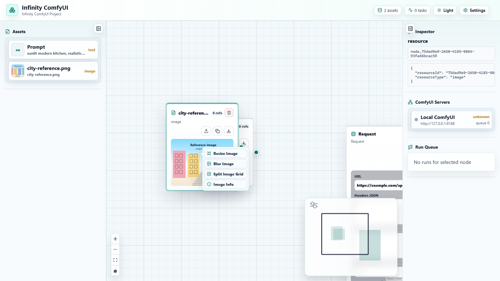
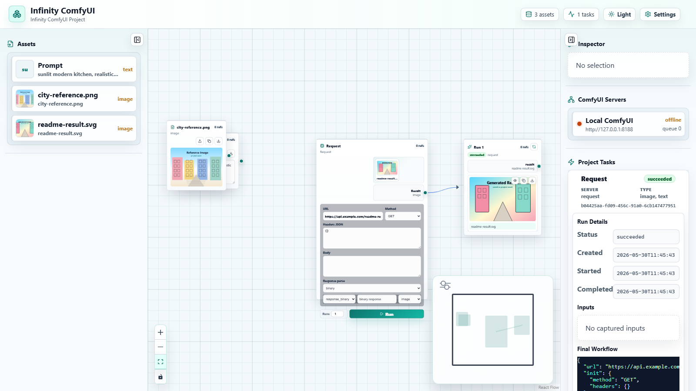
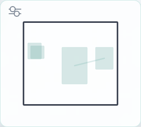

# Infinity ComfyUI

Infinity ComfyUI 是一个纯前端无限画布 AI 工作台，用来把 ComfyUI API 工作流、OpenAI/Gemini 内置节点、文本/图片/视频/音频/数值资产组织成可视化节点流程。它的目标不是复刻 ComfyUI，而是提供一个更适合批量生成、结果对比、任务追踪和多模型编排的上层工作台。

当前版本支持浏览器运行，也支持打包为 Windows 桌面程序。

## 界面总览


主界面由三部分组成：

- 左侧 `Assets`：项目资产列表，文本、图片、视频、音频、数值都会以预览卡片显示。
- 中间无限画布：双击空白处创建节点，拖动连接点组织工作流，支持缩放、框选、多选、复制粘贴和撤销。
- 右侧状态栏：显示选中节点的 Inspector、ComfyUI 服务器状态、项目任务卡片和运行详情。
- 右上角 `Light` / `Dark`：切换亮色或暗色主题，默认使用亮色主题。
- 右上角 `Settings`：进入项目、功能、ComfyUI 服务器、导入导出等管理页面。

## 快速启动

### 浏览器版本

已提供一键启动脚本：

```bat
start.bat
```

或者手动启动：

```powershell
npm install
npm run dev -- --host 127.0.0.1 --port 7930
```

启动后打开：

```text
http://127.0.0.1:7930
```

### Docker 版本

构建镜像：

```powershell
docker build -t infinity-comfyui:local .
```

启动容器：

```powershell
docker run --rm -p 7930:7930 --name infinity-comfyui infinity-comfyui:local
```

或者使用 Compose：

```powershell
docker compose up -d --build
```

启动后打开：

```text
http://127.0.0.1:7930
```

如果 ComfyUI 跑在宿主机本地，容器内的嵌入式 ComfyUI 代理会默认把 `127.0.0.1` / `localhost` 转到 `host.docker.internal`。在不支持该主机名的 Linux Docker 环境里，请保留 `docker-compose.yml` 里的 `extra_hosts`，或手动添加 `--add-host host.docker.internal:host-gateway`。

### 发布目录

导出可拷走的 Docker 发布目录：

```powershell
npm run export:dist
```

导出后 `dist/` 就是发布目录，包含：

- `docker-compose.yaml`
- `.env`
- `start.ps1` / `start.bat` / `stop.ps1`
- `start.sh` / `stop.sh`
- `images/*.tar` Docker 镜像包
- `manifest.json`

默认会先重建 `INFINITY_COMFYUI_IMAGE`，再导出 `packaging/release.env` 中 `RELEASE_IMAGE_REFS` 指定的两个镜像。目标机器进入 `dist/` 后运行 `start.ps1` 或 `start.sh` 即可加载镜像并启动发布版 Compose 里的所有服务。

### Windows 桌面版本

```powershell
npm install
npm run package:win
```

构建产物会输出到 `release/`，包含 portable 版本和安装包版本。

### 常用开发命令

```powershell
npm run dev            # 启动浏览器开发服务
npm test               # 运行单元测试
npm run typecheck      # TypeScript 类型检查
npm run lint           # ESLint 检查
npm run build          # 构建前端产物到 app-dist/
npm run export:dist    # 导出 Docker 发布目录 dist/
npm run serve          # 服务 app-dist/ 生产产物
npm run browser:smoke  # 浏览器端冒烟测试
npm run electron       # 构建后启动 Electron
npm run package:win    # 打包 Windows exe
```

## 基本使用流程

### 1. 配置 ComfyUI 服务器



点击右上角 `Settings`，进入 `ComfyUI Server Management`：

- 新增服务器：填写名称、URL，例如 `http://127.0.0.1:8188`。
- 自定义 Headers：用于鉴权或代理网关，例如 `Authorization`。
- 启用/禁用服务器：禁用后不会参与任务调度。
- 测试连接：确认 `/queue`、`/prompt`、`/history/{prompt_id}` 等接口可访问。
- 状态刷新：程序会每 5 秒检查一次服务器状态和队列数量。

多个 ComfyUI 服务器启用后，程序会维护与服务器数量对应的 worker。任务进入内部队列后，由空闲 worker 取队列首个任务执行。

### 2. 配置 ComfyUI 功能节点



点击 `Settings`，进入 `Function Management`。这里配置的是“可在画布上创建的功能节点”。

配置步骤：

1. 点击 `Function` 新建功能。
2. 选择功能类型：`comfyui`、`request`、`openai` 或 `gemini`。
3. ComfyUI 功能可以粘贴 API Workflow JSON，也可以点击 `Edit in ComfyUI` 在嵌入式 ComfyUI 页面里编辑。
4. 点击 `Save from ComfyUI` 时会同时保存 UI 工作流和可调用的 API 工作流。
5. 点击 `Format JSON` 格式化并检查语法。
6. 在 `Inputs` 中绑定工作流输入字段。
7. 在 `Outputs` 中选择输出节点和输出类型。
8. 保存后，双击画布即可在菜单中看到该功能节点。

嵌入式 ComfyUI 编辑器说明：

- 打开已有 UI 工作流时会走 ComfyUI 的 File Open 逻辑，保留节点和连线。
- 保存时会触发 ComfyUI 的导出逻辑，分别得到 UI 工作流和 `Export (API)` 等价的调用工作流。
- 如果导入的是非 API 工作流，可以先用嵌入式 ComfyUI 打开，再保存为可运行的 API 工作流。
- 如果导入的是 API JSON，仍可作为调用工作流保存，但 UI 编辑能力取决于 ComfyUI 是否能恢复对应图。

输入绑定说明：

- `Workflow Input` 以节点 id 为唯一索引，适合处理多个同名节点的 ComfyUI 工作流。
- 选择顺序是工作流节点 -> 字段路径，避免手动输入 id 时出错。
- `Required` 表示必填输入，画布节点上会高亮为必选。
- `Optional` 的文本和数值输入会直接显示在功能节点上，也可以通过连线覆盖。
- Optional 默认值会从工作流 JSON 中读取。

输出绑定说明：

- 输出选择的是工作流中的输出节点，例如 `Save Image`、`Save Video`、音频输出节点等。
- 支持 `image`、`video`、`audio`、`text` 等类型。
- ComfyUI history 中常见输出结构都会解析，例如：
  - 图片：`outputs[id].images`
  - 视频：`outputs[id].images` 且文件为 `.mp4` 或 `animated: true`
  - 音频：`outputs[id].audio`

内置 OpenAI/Gemini/Request/本地工具节点不会从全局功能管理中删除。需要修改内置节点时，可以在画布上右键功能节点并选择编辑入口，程序会先生成可编辑副本。

### 3. 编辑画布上的功能节点



选中或直接右键功能节点，会弹出功能节点菜单：

- `Edit This Node`：只编辑当前节点。程序会复制当前函数定义，给当前节点切换到新的独立函数，其它同类型节点不受影响。
- `Edit All Nodes`：编辑当前节点所属的函数类型。所有仍引用这个函数的节点会同步更新。
- 已经通过 `Edit This Node` 单独编辑过的节点会使用自己的函数定义，之后不会再受 `Edit All Nodes` 影响。
- 对内置函数使用 `Edit All Nodes` 时，会先把当前同类内置节点切换到一个可编辑副本，不会覆盖内置函数本身。

右键打开的编辑弹窗和 Settings 里的 `Function Management` 使用同一套功能：可以改名称、描述、工作流 JSON、嵌入式 ComfyUI 工作流、输入绑定、输出绑定，以及 request/openai/gemini 配置。

### 4. 创建和编辑资产节点



在画布空白处双击，会弹出创建菜单：

- `Text Asset`：创建多行文本节点，默认内容为空字符串。
- `Number Asset`：创建数值节点。
- `Image Asset`：创建图片节点。
- `Video Asset`：创建视频节点。
- `Audio Asset`：创建音频节点。
- 功能节点：菜单中会直接显示具体功能名称，例如 `Flux2 Text To Image`、`OpenAI Generate Image`。

资产节点支持：

- 上传、下载、复制内容。
- 图片/视频/音频拖放替换资源。
- 从系统剪贴板粘贴文本或媒体到画布。
- 从可选文本/数值输入拉出线创建资产节点时，会继承当前 optional 的值。
- 点击左侧 Assets 列表项可以弹窗查看资源；双击列表项会跳转到对应画布节点。
- 双击资产节点中间的资源预览可以查看大图、播放视频或播放音频。
- 图片、视频、音频预览都会按长边缩放并保持长宽比。

### 5. 连接节点并运行



画布连接规则：

- 从节点右侧输出点拖到另一个节点左侧输入点建立连接。
- 从输入点或输出点拖出线但未连接到节点时，会弹出创建菜单。
- 从输入端拉出创建节点时，会自动把新节点连回当前输入。
- 非拉线创建的节点不会自动补线。
- 连线带方向箭头，支持选中后按 `Del` 删除。
- 可以连接运行中或排队中的结果资源。下游节点运行时如果依赖资源还没生成，会进入 pending 等待状态。
- pending 依赖可以多级串联；上游成功后下游会自动继续执行，上游失败时依赖它的下游会立即失败。

功能节点运行：

- `Runs` 控制执行次数，等同于连续点击多次 Run。
- 每次 run 会使用独立种子，除非是 failed 节点的 rerun。
- 点击 Run 后会立即创建对应数量的输出节点，输出节点自行轮询自己的结果。
- 必填输入缺失时，节点会红色高亮提醒，不会自动补线。
- Optional 文本/数值可以直接在节点上编辑，也可以被连线覆盖；覆盖后输入框变为不可编辑，并显示覆盖来源值。
- 已连接的文本、数值、图片、视频、音频都会在功能节点输入槽里显示小预览；断开连线后预览会立即消失。
- 功能节点输出槽会在上方显示横向滚动的结果资源预览；每次生成新资源后会自动滚到最新结果。

### 6. 查看结果、重跑和对比

运行结果会显示在 run 节点里，图片、视频、音频、文本都可以直接预览。

支持的结果操作：

- 小眼睛：查看完整内容。
- 下载：保存当前内容。
- 复制：复制内容本身，图片/音频/视频会复制为可用的资源内容或数据。
- Rerun：失败结果会用相同参数和种子直接重跑。
- 成功结果 rerun：会先确认是否覆盖。
- Running 节点：显示取消按钮，取消时会对对应 ComfyUI 发送 `interrupt`。
- Queued 节点：取消时只从本地队列移除。

如果一次 run 返回多张图片，run 节点会用 grid 展示。点击小眼睛后，可以在同一功能节点产生的同类型结果之间用左右按钮或键盘方向键切换。

点击任意资源预览都可以打开查看弹窗，按 `Esc` 可以关闭返回画布。双击资源预览会跳转到对应的资源或结果节点。

选中资源节点或结果节点后右键，会打开本地功能菜单。可用工具会根据资源类型自动筛选，例如图片资源会显示 Resize、Blur、Split Grid、Image Info，文本资源会显示 Trim、Text Case。



选中两个 run 节点时会出现 `Compare` 操作，可以打开对比视图，用鼠标横向移动做纵向切片对比，适合比较两张生成图的差异。

### 7. 查看任务详情和排错



右侧 `Project Tasks` 会把每个任务显示为卡片，包含：

- 功能名称
- 服务器
- 输出类型
- 当前状态：`queued`、`running`、`succeeded`、`failed`

点击任务卡片可以查看详细信息：

- Required 输入内容
- Optional 输入内容
- 最终提交给 ComfyUI 或模型 API 的工作流/请求
- 开始时间和结束时间
- Prompt ID、服务器、错误信息

每个 run 节点也会保存自己的完整运行信息，因此即使节点运行失败，也可以在 Inspector 或任务详情里看到失败原因。

## 画布导航



画布右下角有 ComfyUI 风格的 minimap：

- 会根据当前节点分布自适应缩放。
- 深色矩形表示节点缩略图，连线会按画布关系同步显示。
- 白色视口框表示当前可见区域。
- 拖动视口框可以快速移动画布。

## 内置节点

除了自定义 ComfyUI 工作流功能，程序还内置了以下节点：

- `OpenAI LLM`：调用 Chat Completions API，支持 system/user messages，最多 6 张可选图片输入，图片会以 base64 data URL 传入。
- `Gemini LLM`：调用 Gemini API，支持文本与最多 6 张可选图片输入。
- `OpenAI Generate Image`：默认模型 `gpt-image-2`，支持最多 10 张可选图片输入，以及模型名、尺寸、质量、背景、格式、压缩等参数。连接图片输入时走图片编辑接口。
- `Gemini Generate Image`：默认 Nano Banana 2 相关配置，支持 prompt、最多 10 张可选图片输入、比例、尺寸等参数。

OpenAI/Gemini 节点不会进入 ComfyUI 队列，它们直接调用对应 API。

## 画布快捷操作

| 操作 | 说明 |
| --- | --- |
| 双击画布空白处 | 打开添加节点菜单 |
| 右键画布空白处 | 打开添加节点菜单 |
| 双击节点标题 | 修改节点标题 |
| 右键功能节点 | 打开 `Edit This Node` / `Edit All Nodes` 菜单 |
| 选中资源或结果节点后右键 | 打开本地资源工具菜单 |
| 拖动节点 | 移动节点 |
| 拖动节点右下角 | 调整节点大小 |
| `Ctrl` + 框选 | 框选多个节点 |
| `Shift` + 选择 | 追加选中节点 |
| `Alt` + 选择 | 从当前选择中移除节点 |
| `Del` | 删除选中的节点或连线 |
| `Ctrl + C` | 复制选中节点参数，不复制连线 |
| `Ctrl + V` | 粘贴节点；如果没有复制节点，则尝试从剪贴板创建文本/图片/视频/音频节点 |
| `Ctrl + Z` | 撤销上一次操作，常用于恢复误删节点或连线 |
| 小眼睛按钮 | 查看完整结果 |
| `Esc` | 关闭资源查看弹窗或收起当前浮层 |
| 选中两个 run 节点 | 显示 Compare 对比入口 |

## 项目和配置

项目数据会在浏览器支持的环境中自动保存到 IndexedDB。本地桌面版会把项目和资产保存在本地程序可访问的项目数据中；浏览器版会使用浏览器存储。

资产持久化规则：

- 上传的图片、视频、音频会作为项目资产保存。
- ComfyUI、OpenAI、Gemini、Request、本地工具运行生成的资源也会保存到项目资产里。
- 全量导出的 `.aicanvas` 会包含项目 JSON、资产清单和资产文件，重新导入后可以恢复资源预览与节点引用。

Settings 中提供：

- Project：切换、新建、编辑、移除项目。
- Function Management：管理 ComfyUI 工作流功能。
- ComfyUI Server Management：管理服务器、状态、headers。
- Import / Export：导入导出项目和配置包。

导出格式：

- `.aicanvas`：项目画布、资产、任务等数据。
- `.aicanvas-config`：功能、服务器等配置数据。

## 版本规则

发布 tag 固定使用 `v大版本.小版本.迭代号`：

- 修 bug：只增加迭代号，例如 `v1.2.3` -> `v1.2.4`。
- 新增或修改功能：增加小版本号，并将迭代号归零，例如 `v1.2.3` -> `v1.3.0`。
- 页面重构：增加大版本号，并将小版本号与迭代号归零，例如 `v1.2.3` -> `v2.0.0`。

## 发布流程

仓库包含 GitHub Actions release workflow。推送 `v*` tag 后会自动构建 Windows release，并上传 portable 和安装包：

```powershell
git tag v0.1.0
git push origin v0.1.0
```

Docker 发布目录通过本地 `npm run export:dist` 生成，因为它会打包 `packaging/release.env` 指定的本机 Docker 镜像；如果其中的外部镜像没有公开 registry 地址，GitHub Actions runner 无法自动生成同等的离线镜像包。

## 常见问题

### 打开桌面版后空白

请确认使用的是最新构建产物，并重新执行：

```powershell
npm run package:win
```

### ComfyUI 没有返回结果

优先检查右侧任务卡片：

- 是否进入 `failed`
- 是否有接口错误
- Prompt ID 是否存在
- 输出节点 id 是否绑定正确
- ComfyUI history 中输出字段是否与功能配置的类型一致

### 多个工作流节点重名导致绑定错误

功能配置以工作流节点 id 作为唯一索引，不依赖节点 title。遇到同名节点时，请在下拉选项中确认 id，而不是只看 title。

### 浏览器版本访问本地 ComfyUI 失败

浏览器直接请求 ComfyUI 时可能受到 CORS 或网络策略影响。可以优先使用桌面版，或在 ComfyUI/代理层允许来自本地前端地址的请求。

## 需求来源

产品需求来源文件：

```text
纯前端无限画布AI工作台需求文档_V1.1.md
```
