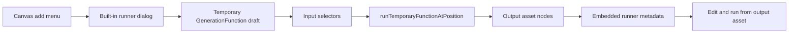

# Built-In Runners Design

## Materials

- User requirement: add built-in menu runners for ComfyUI, Request, OpenAI, and Gemini. These runners should work without creating a saved function template.
- Existing code: `src/components/CanvasWorkspace.tsx` already has the add menu, function run dialog, asset selectors, and canvas asset pick mode.
- Existing code: `src/components/WorkbenchPanels.tsx` already has the embedded ComfyUI editor and function management UI.
- Existing code: `src/domain/comfyEditorBridge.ts` already exports both UI and API workflows from embedded ComfyUI.
- Existing code: `src/domain/workflow.ts` currently derives ComfyUI inputs from CLIP text and LoadImage nodes and derives common outputs.
- Existing code: Request, OpenAI, and Gemini already exist as built-in generation functions in `src/domain/requestFunction.ts`, `src/domain/openaiLlm.ts`, `src/domain/geminiLlm.ts`, `src/domain/openaiImage.ts`, and `src/domain/geminiImage.ts`.

## Goal

Add direct built-in runners to the canvas add menu so users can run ComfyUI, Request, OpenAI, and Gemini without first creating a saved function. Saved functions remain reusable templates created only when the user explicitly chooses to save one.

## Concepts

### Built-In Runner

A built-in runner is an immediate run surface for a provider or execution type. It opens a dialog, collects inputs, runs, and creates output assets. It does not add a function to the project template library.

Built-in runners:

- ComfyUI Workflow
- Request
- OpenAI LLM
- Gemini LLM
- OpenAI Image
- Gemini Image

### Function Template

A function is a reusable template. Users can still create and manage ComfyUI, Request, OpenAI, and Gemini function templates from Settings. A built-in runner may offer `Save as Function`, but saving is explicit.

### Temporary Function Draft

The runner dialog uses an in-memory `GenerationFunction` draft. It has a temporary id and can be passed to the existing run pipeline without being stored in `project.functions`.

Temporary draft behavior:

- It can render through the existing `FunctionRunDialog`.
- It can run through a new store action that accepts a `GenerationFunction` object.
- It can write the function config/workflow into output asset metadata so the asset can be edited and run again.
- It is not listed in Settings.

## Menu Design

The canvas add menu should have two sections:

- `Built-in`: ComfyUI Workflow, Request, OpenAI LLM, Gemini LLM, OpenAI Image, Gemini Image.
- `Functions`: saved user function templates.

The current behavior of pre-filling inputs from selected assets remains. If assets are selected before choosing a runner, compatible inputs are filled in order.

## ComfyUI Runner Flow

1. User right-clicks canvas or an asset and chooses `ComfyUI Workflow`.
2. A ComfyUI runner dialog opens.
3. User selects a ComfyUI server.
4. User opens the embedded ComfyUI editor, builds or imports a workflow, then clicks `Save from ComfyUI`.
5. The app captures UI workflow plus API workflow.
6. The app derives draft inputs and outputs from the API workflow.
7. The lower half of the dialog immediately shows the input selectors.
8. User selects assets, manually enters primitive values, or uses canvas pick mode.
9. User clicks `Run`.
10. Output assets are created on the canvas; each output asset contains enough metadata to reconstruct the temporary ComfyUI draft later.

The first implementation should refresh inputs immediately after `Save from ComfyUI`. It should not depend on live iframe graph-change events.

## Input Detection

ComfyUI input detection should move into a focused domain unit and support more types than the current implementation.

Required automatic input detection:

- Text: CLIPTextEncode text fields and class/input names containing text, prompt, caption, or string.
- Number: primitive numeric widget inputs that are not graph links.
- Image: LoadImage and class/input names containing image.
- Video: class/input names containing video, VHS, frame, frames, movie, mp4, or webm.
- Audio: class/input names containing audio, sound, wav, mp3, or voice.

Detection rules:

- Ignore graph links such as `[sourceNodeId, outputIndex]`.
- Keep stable keys derived from node title and input path.
- Mark media inputs as required by default.
- Mark primitive inputs as optional if the workflow already has a primitive value.
- Keep existing prompt and LoadImage friendly labels where possible.

Outputs should detect:

- image output nodes
- video output nodes
- audio output nodes
- text output nodes

## Request/OpenAI/Gemini Runner Flow

Request, OpenAI, and Gemini built-in runners use the same dialog as function templates, but their draft config starts from the existing built-in defaults. The dialog should expose the same input selectors and run controls. Provider-specific editing can remain minimal for this pass:

- Request uses the existing default request function config.
- OpenAI LLM and Gemini LLM use their existing default multimodal text configs.
- OpenAI Image and Gemini Image use their existing default image configs.

The user can run these directly. Saving as a function template can be added as a visible action after the run dialog is stable.

## Data Flow

## Error Handling

- If no ComfyUI server is enabled, show a disabled editor button and an inline error.
- If ComfyUI export fails, keep the dialog open and show the capture error.
- If input detection finds no outputs, create the existing fallback text output.
- If a required input is missing, disable Run with the missing input names.
- If provider credentials are missing, let the existing execution error path mark the output as failed.

## Testing Strategy

- Domain tests for ComfyUI input detection across text, number, image, video, and audio.
- Component tests for menu sections showing built-in runners separately from saved functions.
- Component tests for choosing Request/OpenAI/Gemini built-ins opening the run dialog without creating a function.
- Component tests for saving a ComfyUI workflow draft causing input selectors to appear.
- Store tests for running a temporary function without persisting it into `project.functions`.

## Acceptance Criteria

- The add menu shows a Built-in section with ComfyUI Workflow, Request, OpenAI LLM, Gemini LLM, OpenAI Image, and Gemini Image.
- Choosing Request/OpenAI/Gemini opens the run dialog directly.
- Choosing ComfyUI opens a workflow runner that can save from embedded ComfyUI and then show input selectors.
- Temporary runners do not add entries to Settings function templates.
- ComfyUI auto-detection covers text, number, image, video, and audio inputs.
- Existing saved function templates still work.
- Full test suite and production build pass.
